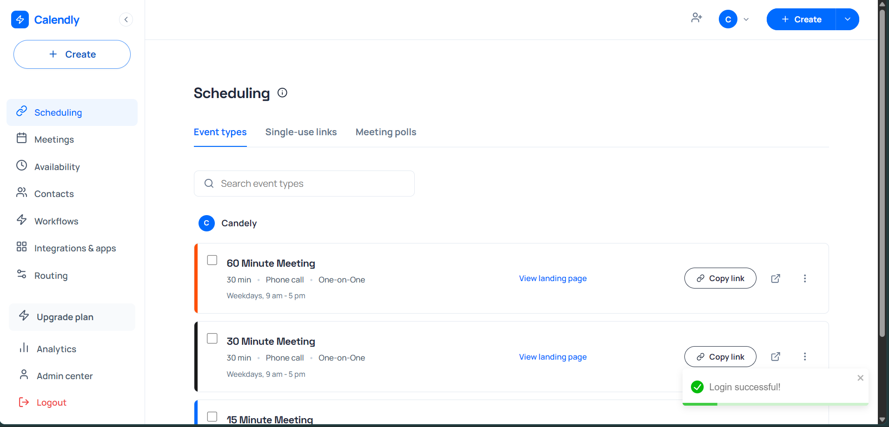

# Candely - Scheduling Platform (Calendly Clone)

Candely is a full-stack scheduling application that allows users to manage event types, set availability, and let others book time slots through a public booking page.

## Tech Stack

- **Frontend**: React.js (Vite), Lucide-react, date-fns, Axios, React Router.
- **Backend**: Node.js, Express.js.
- **Database**: PostgreSQL (via Prisma ORM). _Note: Currently configured with SQLite for easy local setup without additional database installation._
- **Styling**: Vanilla CSS with modern premium design patterns.

## Features

- **Event Types Management**: Create, view, and manage different scheduling links.
- **Availability Settings**: Set weekly recurring availability and timezone.
- **Public Booking Page**: Interactive calendar view with real-time slot availability.
- **Double Booking Prevention**: Prevents multiple bookings for the same time slot.
- **Meetings Dashboard**: View upcoming and past meetings, with cancellation functionality.
- **Responsive Design**: Works across Desktop, Tablet, and Mobile.

## UI Preview

The frontend includes a set of public images that showcase the app UI and brand assets.

<table>
	<tr>
		<td align="center"><br />Profile avatar</td>
	</tr>
	<tr>
		<td align="center"><br />Screenshot 1</td>
		<td align="center"><br />Screenshot 2</td>
	</tr>
	<tr>
		<td align="center"><br />Screenshot 3</td>
		<td align="center"><br />Screenshot 4</td>
	</tr>
	<tr>
		<td align="center"><br />Screenshot 5</td>
		<td align="center"><br />Screenshot 6</td>
	</tr>
	<tr>
		<td align="center"><br />Screenshot 7</td>
		<td align="center"><br />Screenshot 8</td>
	</tr>
</table>

## Setup Instructions

### 1. Clone the repository

```bash
git clone <your-repo-link>
cd candely
```

### 2. Backend Setup

```bash
cd backend
npm install
# The project comes with a pre-configured SQLite database.
# To initialize/migrate:
npx prisma migrate dev --name init
# Seed sample data:
node prisma/seed.js
# Start the server:
node src/index.js
```

The backend will run on `http://localhost:5000`.

### 3. Frontend Setup

```bash
cd ../frontend
npm install
# Start the development server:
npm run dev
```

The frontend will run on `http://localhost:5173`.

### Demo Login

Use the seeded admin account to sign in:

- Email: `admin@candely.com`
- Password: `admin123`

## Assumptions & Design Decisions

1. **No Login Required**: As per the assignment requirement, a default user is assumed to be logged in for the admin side.
2. **Database Choice**: While the requirement specified PostgreSQL/MySQL, I used **SQLite** for development to ensure the project runs immediately on your machine without needing a database server setup. The schema is fully compatible with PostgreSQL and can be switched by changing the `provider` in `schema.prisma`.
3. **Timezones**: Currently defaults to UTC for simplified slot calculations in the demo.
4. **Custom Calendar**: Instead of using heavy libraries like FullCalendar, I implemented a custom, lightweight, and high-performance calendar component to match Calendly's specific UI patterns.

## Deployment

- **Backend**: Can be deployed to Render or Railway.
- **Frontend**: Can be deployed to Vercel or Netlify.
- **Database**: Use Supabase or Railway for a production PostgreSQL instance.

### Production API setup

- Set `VITE_API_URL` in the frontend deployment to your Render backend URL, for example `https://your-backend.onrender.com`.
- The frontend app will normalize that value to `https://your-backend.onrender.com/api` automatically.
- Set `CORS_ORIGIN` on the backend to your frontend origin, for example `https://your-frontend.vercel.app`.
